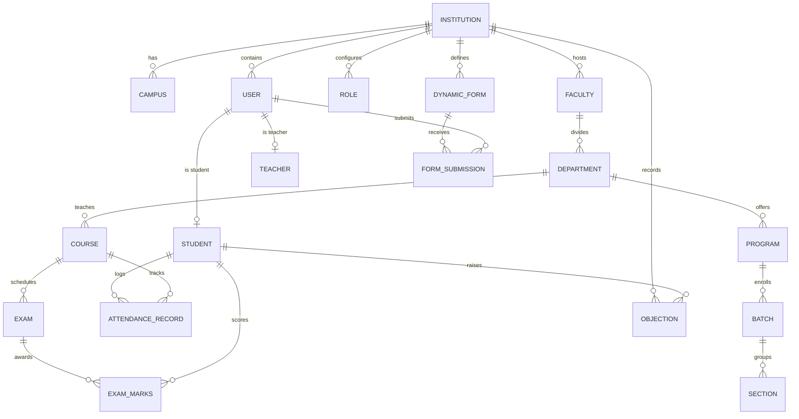
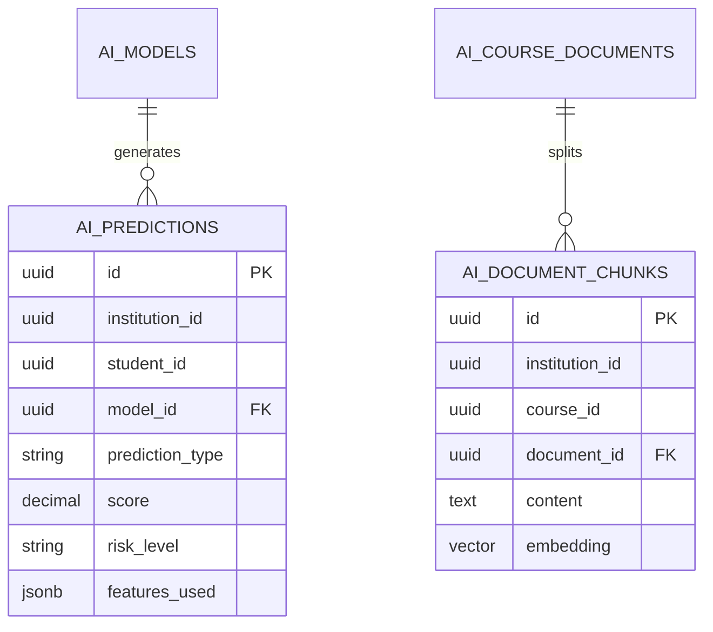
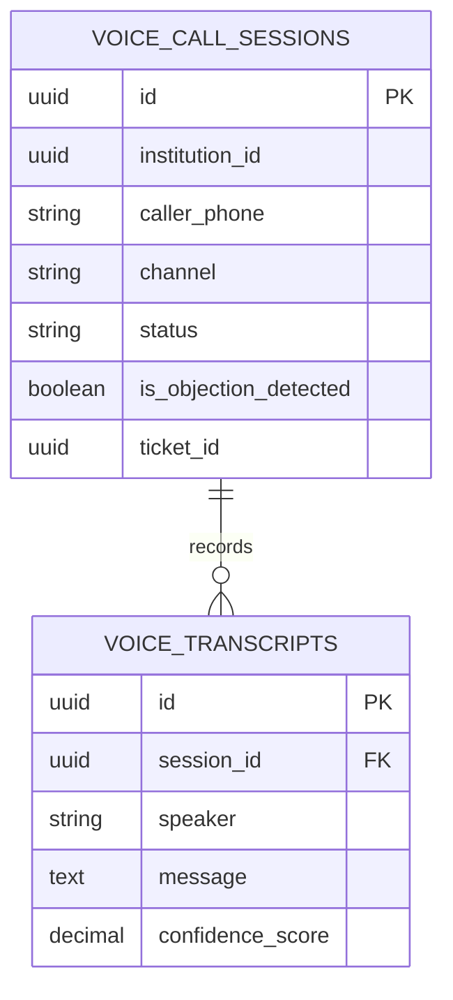

# Entity Relationship Diagrams (ERD)

## 1. Core ERP Domain ERD

```mermaid
erDiagram
    INSTITUTION ||--o{ CAMPUS : has
    INSTITUTION ||--o{ USER : contains
    INSTITUTION ||--o{ ROLE : configures
    INSTITUTION ||--o{ FACULTY : hosts
    FACULTY ||--o{ DEPARTMENT : divides
    DEPARTMENT ||--o{ PROGRAM : offers
    PROGRAM ||--o{ BATCH : enrolls
    BATCH ||--o{ SECTION : groups
    DEPARTMENT ||--o{ COURSE : teaches
    
    USER ||--o| STUDENT : "is student"
    USER ||--o| TEACHER : "is teacher"
    
    STUDENT ||--o{ ATTENDANCE_RECORD : logs
    COURSE ||--o{ ATTENDANCE_RECORD : tracks
    COURSE ||--o{ EXAM : schedules
    EXAM ||--o{ EXAM_MARKS : awards
    STUDENT ||--o{ EXAM_MARKS : scores
    
    INSTITUTION ||--o{ DYNAMIC_FORM : defines
    DYNAMIC_FORM ||--o{ FORM_SUBMISSION : receives
    USER ||--o{ FORM_SUBMISSION : submits
    
    INSTITUTION ||--o{ OBJECTION : records
    STUDENT ||--o{ OBJECTION : raises
```

---

## 2. AI Backend Domain ERD

```mermaid
erDiagram
    AI_MODELS ||--o{ AI_PREDICTIONS : generates
    AI_COURSE_DOCUMENTS ||--o{ AI_DOCUMENT_CHUNKS : splits
    
    AI_DOCUMENT_CHUNKS {
        uuid id PK
        uuid institution_id
        uuid course_id
        uuid document_id FK
        text content
        vector embedding
    }
    
    AI_PREDICTIONS {
        uuid id PK
        uuid institution_id
        uuid student_id
        uuid model_id FK
        string prediction_type
        decimal score
        string risk_level
        jsonb features_used
    }
```

---

## 3. Voice Assistant Backend Domain ERD

```mermaid
erDiagram
    VOICE_CALL_SESSIONS ||--o{ VOICE_TRANSCRIPTS : records
    
    VOICE_CALL_SESSIONS {
        uuid id PK
        uuid institution_id
        string caller_phone
        string channel
        string status
        boolean is_objection_detected
        uuid ticket_id
    }
    
    VOICE_TRANSCRIPTS {
        uuid id PK
        uuid session_id FK
        string speaker
        text message
        decimal confidence_score
    }
```

